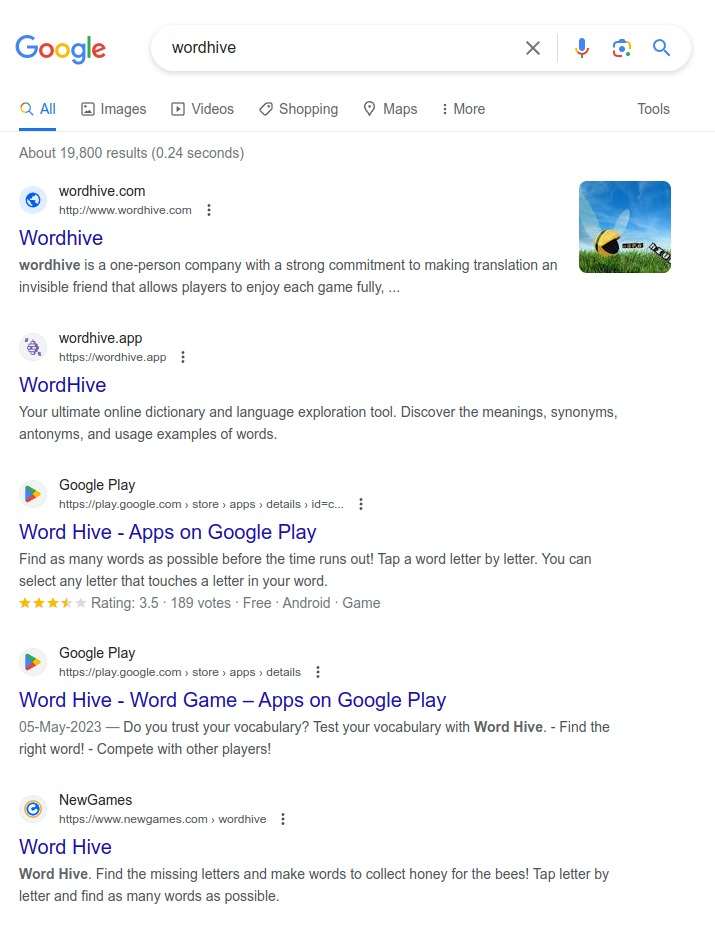

  

###

  
  
  

###

  

###

<h1 align="center">
  
</h1>

###

<h3 align="left">👩‍💻  About Me</h3>

###

👋 Hi, I'm Shubham Kandalgaonkar, a BCA graduate student hailing from India.  📚 I'm currently learning the ins and outs of M.E.R.N. Stack Web Development to broaden my knowledge and stay up-to-date with the latest technologies.  ⚡ In my free time, I enjoy building new projects using web technologies, and I'm also an avid player of FPS games.

###

<h3 align="left">🛠 Language and Tools</h3>

###

  
  
  
  
  
  
  
  
  
  
  
  
  
  
  
  
  
  
  
  
  
  
  
  
  
  
  

###

<h3 align="left">👨🏻‍💻 Software and Technologies</h3>

###

  
  
  
  
  

###

<h3 align="left">💻   Recent Projects :</h3>

###

#2 in Google Search Results 🎉

 

###

<h3 align="left">🔥   My Stats :</h3>

###

  
  

###
