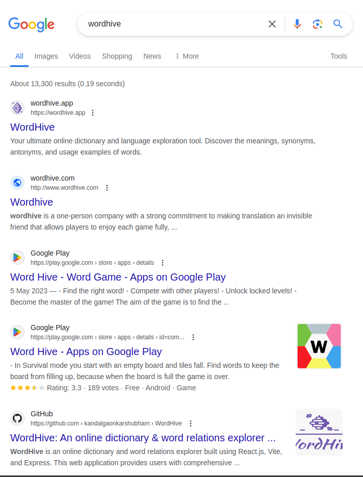

  
  
  
  
  

###

  

###

👋🏻 Hi, I'm Shubham Kandalgaonkar, a BCA graduate student hailing from India.  💼 I'm currently working at <a href="https://xplorebits.com/" target="_blank">Xplorebits</a> as a Full Stack Engineer.  👨🏻‍💻 I specialize of M.E.R.N. Stack Development & like to broaden my knowledge and stay up-to-date with the latest technologies.  🎧 I love Phonk  ⚡ In my free time, I enjoy building new projects using web technologies, and I'm also an avid player of FPS games.  😏 I use Arch and Neovim, btw

###

<h3 align="left">🛠 Language and Technologies</h3>

###

&nbsp;&nbsp;&nbsp;&nbsp;&nbsp;&nbsp;

&nbsp;&nbsp;&nbsp;&nbsp;

&nbsp;&nbsp;&nbsp;&nbsp;&nbsp;&nbsp;

&nbsp;&nbsp;&nbsp;&nbsp;&nbsp;

###

<h3 align="left">💻   Recent Projects :</h3>

###

#1 in Google Search Results 🎉

 

###

<h3 align="left">🔥   My Stats :</h3>

###

  
  

###

